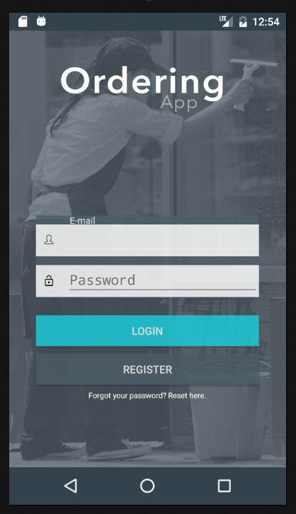

# An Android app for ordering cleaning products. In progress , Android

The purpose of the application is to support an ordering process of the cleaning products on the places serviced by the cleaning company. The main aspect is to help employees when they need products to work, also optimize and modernize the communication between the manager and employees.

```
* JAVA
* FIREBASE
* AsyncTASK
* ...

```

## Screenshots

<p align="center">
  
</p>


